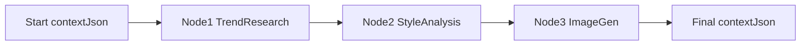

# Context mapping — pipeline 3 node (Trend → Analysis → Image Gen)

Tài liệu **học mapping**: Shared Context, `inputMapping`, `outputMapping`, merge sau mỗi step.  
Tập trung phần “đầu” (chưa đi sâu tool Flux / enrichment).

> **Lưu ý:** Trên Platform thật, Milestone 2 tách thành nhiều Workflow (`kids-fashion-trend-research`, `kids-fashion-style-analysis`, `kids-fashion-image-generation`, …) mỗi cái vài node.  
> Ở đây gộp thành **1 module dạy 3 node** để dễ nhìn cách context lớn dần. Agent / giá trị lấy từ seed + stub fixture thật.



**Code orchestrator mỗi step (lặp lại 3 lần):**

```164:187:src/modules/executions/services/execution-orchestrator.service.ts
      const context = { ...currentExecution.contextJson };
      const mappedInput = applyInputMapping(context, node.inputMapping);
      // ...
        const output = await this.agentRunner.invoke({ ..., input: mappedInput, ... });
        // ...
        currentExecution.contextJson = applyOutputMapping(context, output, node.outputMapping);
```

---

## Ý tưởng 30 giây

| Khái niệm | Nghĩa đơn giản |
|-----------|----------------|
| `contextJson` | Bảng trắng chung của cả Execution — data sống sót qua các node |
| `inputMapping` | “Lấy key nào từ bảng trắng → đưa vào agent” |
| `mappedInput` | Object agent thật sự nhận (sau mapping) |
| Agent output | JSON agent trả về (LLM hoặc stub fixture) |
| `outputMapping` | “Lấy field nào từ output → ghi lại bảng trắng” |
| Merge | Context mới = context cũ + các key được map (không xóa key cũ) |

`promptRef` / template `{{season}}` dùng **`mappedInput`** để điền chỗ trống **trước** khi gọi LLM — xem cuối file.

---

## Module dạy: 3 node

| Node | Vai trò | Agent (thật trong seed) | Ghi vào context |
|------|---------|-------------------------|-----------------|
| 1 | Research trend | `fashion-trend-research` | `trendFindings` |
| 2 | Analysis | `fashion-illustration-analyzer` (tổng hợp style report) | `styleReport` |
| 3 | Image gen | `fashion-image-generator` | `rawGenerations` |

Graph dạy (không phải 1 workflow seed sẵn — chỉ để học):

```json
{
  "nodes": [
    {
      "id": "node-trend",
      "agentCode": "fashion-trend-research",
      "inputMapping": {
        "season": "season",
        "category": "category",
        "market": "market",
        "ageBand": "ageBand",
        "constraints": "constraints"
      },
      "outputMapping": { "trendFindings": "trendFindings" }
    },
    {
      "id": "node-analysis",
      "agentCode": "fashion-illustration-analyzer",
      "inputMapping": {
        "season": "season",
        "category": "category",
        "market": "market",
        "trendFindings": "trendFindings"
      },
      "outputMapping": { "styleReport": "styleReport" }
    },
    {
      "id": "node-image-gen",
      "agentCode": "fashion-image-generator",
      "inputMapping": {
        "season": "season",
        "category": "category",
        "market": "market",
        "trendFindings": "trendFindings",
        "styleReport": "styleReport"
      },
      "outputMapping": { "rawGenerations": "rawGenerations" }
    }
  ],
  "edges": [
    { "from": "node-trend", "to": "node-analysis" },
    { "from": "node-analysis", "to": "node-image-gen" }
  ]
}
```

Cách đọc mapping `"left": "right"`:

- **input:** `mappedInput.left = context.right`
- **output:** `nextContext.left = output.right`

---

## Start — `contextJson` ban đầu

User start Execution với:

```json
{
  "season": "SS27",
  "category": "tees",
  "market": "EU",
  "ageBand": "4-8",
  "constraints": { "mustAvoid": ["neon overload"] }
}
```

Chưa có `trendFindings`, `styleReport`, `rawGenerations`.

---

## Node 1 — Trend research

### 1) Input mapping

```
context ──inputMapping──► mappedInput
```

| `mappedInput` key | Lấy từ `context` |
|-------------------|------------------|
| `season` | `SS27` |
| `category` | `tees` |
| `market` | `EU` |
| `ageBand` | `4-8` |
| `constraints` | `{ "mustAvoid": ["neon overload"] }` |

```json
{
  "season": "SS27",
  "category": "tees",
  "market": "EU",
  "ageBand": "4-8",
  "constraints": { "mustAvoid": ["neon overload"] }
}
```

### 2) Agent chạy → output (fixture mẫu)

Agent `fashion-trend-research` (stub fixture trong `stub-agent.fixtures.ts`):

```json
{
  "trendFindings": {
    "summary": "Trend signals for tees SS27 in EU",
    "trends": [
      {
        "name": "Playful color blocking",
        "confidence": 0.82,
        "notes": "Strong in kids apparel references for school + play"
      },
      {
        "name": "Soft technical fabrics",
        "confidence": 0.74,
        "notes": "Comfort-first silhouettes"
      }
    ]
  }
}
```

(Live LLM cũng phải trả shape tương tự theo prompt.)

### 3) Output mapping → merge context

```
outputMapping: { "trendFindings": "trendFindings" }
→ context.trendFindings = output.trendFindings
→ season / category / … giữ nguyên
```

### `contextJson` sau Node 1

```json
{
  "season": "SS27",
  "category": "tees",
  "market": "EU",
  "ageBand": "4-8",
  "constraints": { "mustAvoid": ["neon overload"] },
  "trendFindings": {
    "summary": "Trend signals for tees SS27 in EU",
    "trends": [
      { "name": "Playful color blocking", "confidence": 0.82, "notes": "..." },
      { "name": "Soft technical fabrics", "confidence": 0.74, "notes": "..." }
    ]
  }
}
```

---

## Node 2 — Analysis

### 1) Input mapping

Lần này context **đã có** `trendFindings` → đưa vào agent:

```json
{
  "season": "SS27",
  "category": "tees",
  "market": "EU",
  "trendFindings": {
    "summary": "Trend signals for tees SS27 in EU",
    "trends": [ "...": "..." ]
  }
}
```

Node 2 **không** tự nhìn hết context; chỉ thấy key trong `inputMapping`.  
Nếu quên map `trendFindings`, agent sẽ không nhận trend từ Node 1.

### 2) Agent output (rút gọn từ fixture style report)

```json
{
  "styleReport": {
    "summary": "Trend signals for tees SS27 in EU",
    "colors": [
      { "label": "Soft pastel blue", "notes": "Primary playful accent" }
    ],
    "styles": [
      { "label": "Relaxed silhouette", "notes": "School + play ready" }
    ],
    "patterns": [
      { "label": "Soft geometric blocks", "notes": "Large-scale, low noise" }
    ],
    "recommendations": [
      {
        "label": "Carry color-block tee into image generation",
        "notes": "Align palette with cream base and pastel accents"
      }
    ]
  }
}
```

### 3) Merge

```
outputMapping: { "styleReport": "styleReport" }
```

### `contextJson` sau Node 2

```json
{
  "season": "SS27",
  "category": "tees",
  "market": "EU",
  "ageBand": "4-8",
  "constraints": { "mustAvoid": ["neon overload"] },
  "trendFindings": { "...từ node 1...": "..." },
  "styleReport": {
    "summary": "Trend signals for tees SS27 in EU",
    "colors": [{ "label": "Soft pastel blue" }],
    "styles": [{ "label": "Relaxed silhouette" }],
    "patterns": [{ "label": "Soft geometric blocks" }],
    "recommendations": [{ "label": "Carry color-block tee into image generation" }]
  }
}
```

Hai key mới chồng lên nhau: `trendFindings` + `styleReport`. Không mất data Node 1.

---

## Node 3 — Image gen

### 1) Input mapping

Agent gen ảnh nhận trend + analysis (+ season…):

```json
{
  "season": "SS27",
  "category": "tees",
  "market": "EU",
  "trendFindings": { "...": "..." },
  "styleReport": { "...": "..." }
}
```

### 2) Agent output (fixture mẫu)

```json
{
  "rawGenerations": [
    {
      "id": "gen-var-1",
      "label": "Hero color-block tee",
      "promptRef": "prompt-var-1",
      "assetUrl": "stub://image-generation/kids-ss27-var-1.png",
      "notes": "Stub mode — metadata only; no live image provider"
    },
    {
      "id": "gen-var-2",
      "label": "Soft cargo companion look",
      "promptRef": "prompt-var-2",
      "assetUrl": "stub://image-generation/kids-ss27-var-2.png",
      "notes": "Stub mode — second variation"
    }
  ]
}
```

(Live + Flux: `assetUrl` sẽ là URL `https://...` từ tool enrichment — xem `EXECUTION_FLOW_IMAGE_GENERATION.md`.)

### 3) Merge

```
outputMapping: { "rawGenerations": "rawGenerations" }
```

### `contextJson` cuối (sau 3 node)

```json
{
  "season": "SS27",
  "category": "tees",
  "market": "EU",
  "ageBand": "4-8",
  "constraints": { "mustAvoid": ["neon overload"] },
  "trendFindings": {
    "summary": "Trend signals for tees SS27 in EU",
    "trends": [ "...": "..." ]
  },
  "styleReport": {
    "summary": "Trend signals for tees SS27 in EU",
    "colors": [ "...": "..." ],
    "styles": [ "...": "..." ]
  },
  "rawGenerations": [
    {
      "id": "gen-var-1",
      "label": "Hero color-block tee",
      "assetUrl": "stub://image-generation/kids-ss27-var-1.png"
    },
    {
      "id": "gen-var-2",
      "label": "Soft cargo companion look",
      "assetUrl": "stub://image-generation/kids-ss27-var-2.png"
    }
  ]
}
```

---

## Nhìn một mạch: context lớn dần

```text
START
  { season, category, market, ageBand, constraints }

AFTER node-trend      (+ trendFindings)
AFTER node-analysis   (+ styleReport)
AFTER node-image-gen  (+ rawGenerations)
```

Mỗi step:

```text
context_cũ
   │ inputMapping
   ▼
mappedInput  →  Agent  →  output
   │
   │ outputMapping (merge có chọn lọc)
   ▼
context_mới = context_cũ + keys mới
```

---

## Liên hệ `{{season}}` (nhanh)

Agent Node 1 có `promptRef` → template kiểu:

```text
Season: {{season}}
Category: {{category}}
Market: {{market}}
```

BE gọi `renderPromptTemplate(template, mappedInput)` **trước** khi gọi LLM:

```text
Season: SS27
Category: tees
Market: EU
```

LLM không thấy `{{}}`. Mapping quyết định **data nào có trong mappedInput** → mới điền được placeholder.

Chi tiết: đoạn `renderPromptTemplate` trong `llm-agent-runner.service.ts`.

---

## Mapping sang Workflow thật trên Platform

| Node dạy | Workflow seed thật (nhiều node hơn) |
|----------|-------------------------------------|
| Trend | `kids-fashion-trend-research` (3 nodes: trend → refs → report) |
| Analysis | `kids-fashion-style-analysis` (+ reference-image / design-brief ở giữa trong pipeline đầy đủ) |
| Image gen | `kids-fashion-image-generation` (prep → generate → organize) |

File chi tiết image gen + tool: [`EXECUTION_FLOW_IMAGE_GENERATION.md`](./EXECUTION_FLOW_IMAGE_GENERATION.md)  
Graph seed: [`workflows.seed.ts`](../../src/infrastructure/database/seeds/workflows.seed.ts)

---

## Checklist nhớ

1. Context = state chung; mapping = ống dẫn chọn field  
2. Agent chỉ thấy `mappedInput`, không tự đọc full context  
3. Output mapping ghi thêm key; không xóa key cũ  
4. Node sau muốn dùng kết quả node trước → **phải** có trong `inputMapping`  
5. `promptRef` / `{{}}` là chuyện Prompt catalog + render từ `mappedInput`, không nằm trong context
