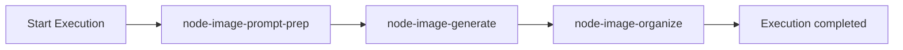

# Execution walkthrough: `kids-fashion-image-generation`

Tài liệu này mô tả **một Execution đầy đủ** (3 agent nodes), kèm code path và **giá trị mẫu cụ thể** của input / biến / return — để hình dung end-to-end.

**Giả định env (live):**

```bash
AGENT_RUNNER=openai          # hoặc ollama | anthropic | gemini (không phải stub)
TOOL_RUNTIME=live
FLUX_API_KEY=bfl_xxx         # hoặc BFL_API_KEY
FLUX_ENDPOINT_PATH=/v1/flux-2-pro
```

**Workflow code:** `kids-fashion-image-generation`  
**Seed graph:** [`workflows.seed.ts`](../../src/infrastructure/database/seeds/workflows.seed.ts) (`IMAGE_GENERATION_DEFINITION`)



---

## 0. Start Execution — input ban đầu

**API:** `POST /api/v1/workflows/{id}/execute` (hoặc tương đương)  
**Service:** `ExecutionsService` → enqueue → `ExecutionOrchestrator` / `WorkflowEngine`

### `execution.inputJson` / initial `contextJson` (ví dụ)

```json
{
  "season": "SS27",
  "category": "tees",
  "market": "EU",
  "ageBand": "4-8",
  "constraints": { "mustAvoid": ["neon overload"] },
  "designBrief": {
    "summary": "Playful color-block kids tee for school + play",
    "themes": [{ "label": "Playful color blocking" }],
    "mustHaves": [{ "label": "Warm cream base with pastel accents" }],
    "avoid": [{ "label": "Harsh neon overload" }]
  },
  "designSpecification": {
    "summary": "Deliver playful color-block kids apparel concept",
    "objectives": [{ "label": "Ready for Image Generation" }],
    "colorDirection": [{ "label": "Cream + pastel blue" }],
    "styleDirection": [{ "label": "Relaxed silhouette" }],
    "patternDirection": [{ "label": "Soft geometric blocks" }],
    "deliverables": [{ "label": "2 artwork variations" }]
  }
}
```

### Biến execution (sau khi tạo)

| Biến | Giá trị mẫu |
|------|-------------|
| `execution.id` | `exec_01HXYZ...` |
| `execution.workflowCode` | `kids-fashion-image-generation` |
| `execution.status` | `running` |
| `execution.contextJson` | = input ở trên (ban đầu) |

---

## 1. Step A — Prepare prompts (`fashion-image-prompt-prep`)

### Graph mapping

```json
{
  "id": "node-image-prompt-prep",
  "agentCode": "fashion-image-prompt-prep",
  "inputMapping": {
    "season": "season",
    "category": "category",
    "market": "market",
    "ageBand": "ageBand",
    "constraints": "constraints",
    "designBrief": "designBrief",
    "designSpecification": "designSpecification"
  },
  "outputMapping": { "imageGenPrompts": "imageGenPrompts" }
}
```

### Code

```173:188:src/modules/executions/services/execution-orchestrator.service.ts
        const output = await this.agentRunner.invoke({
          agentCode: step.agentCode,
          agentVersion: step.agentVersion,
          nodeId: step.nodeId,
          input: mappedInput,
          config: node.config,
          attempt: step.attempt,
        });
        // ...
        currentExecution.contextJson = applyOutputMapping(context, output, node.outputMapping);
```

`applyInputMapping` / `applyOutputMapping`: [`context-mapper.ts`](../../src/modules/executions/services/context-mapper.ts)

### `mappedInput` (sau `applyInputMapping`)

Giống initial context (các key trên được copy từ Shared Context). Agent này **không** có `toolRefs` → không gọi tool.

### Agent output (LLM live — shape kỳ vọng; stub fixture tương đương)

```json
{
  "imageGenPrompts": {
    "summary": "Playful color-block kids tee for school + play",
    "prompts": [
      {
        "id": "prompt-var-1",
        "label": "Hero color-block tee",
        "text": "Kids tees SS27 EU: playful color-block tee, cream base, pastel accents, school-friendly"
      },
      {
        "id": "prompt-var-2",
        "label": "Soft cargo companion look",
        "text": "Kids tees SS27 EU: relaxed soft cargo silhouette, geometric block accents, age-appropriate"
      }
    ]
  }
}
```

### Shared Context sau step A

```json
{
  "season": "SS27",
  "category": "tees",
  "market": "EU",
  "designBrief": { "...": "..." },
  "designSpecification": { "...": "..." },
  "imageGenPrompts": {
    "summary": "Playful color-block kids tee for school + play",
    "prompts": [
      { "id": "prompt-var-1", "label": "Hero color-block tee", "text": "Kids tees SS27 EU: ..." },
      { "id": "prompt-var-2", "label": "Soft cargo companion look", "text": "Kids tees SS27 EU: ..." }
    ]
  }
}
```

| Biến step | Giá trị |
|-----------|---------|
| `step.nodeId` | `node-image-prompt-prep` |
| `step.agentCode` | `fashion-image-prompt-prep` |
| `step.status` | `completed` |
| `step.outputJson.imageGenPrompts.prompts.length` | `2` |

---

## 2. Step B — Generate images (`fashion-image-generator`) + Flux tool

Đây là bước có **tool enrichment** (Flux).

### Graph mapping

```json
{
  "id": "node-image-generate",
  "agentCode": "fashion-image-generator",
  "inputMapping": {
    "season": "season",
    "category": "category",
    "market": "market",
    "imageGenPrompts": "imageGenPrompts",
    "designBrief": "designBrief",
    "designSpecification": "designSpecification"
  },
  "outputMapping": { "rawGenerations": "rawGenerations" }
}
```

### 2.1 Orchestrator → Agent runner

```173:180:src/modules/executions/services/execution-orchestrator.service.ts
        const output = await this.agentRunner.invoke({ ... });
```

`AGENT_RUNNER=openai` → `LlmAgentRunnerService` ([`executions.module.ts`](../../src/modules/executions/executions.module.ts) `createAgentRunner`).

### 2.2 Load agent + `toolRefs`

Seed wire: `fashion-image-generator` → `toolRefs: ["image-generation"]`  
([`tools.seed.ts`](../../src/infrastructure/database/seeds/tools.seed.ts))

```83:87:src/modules/executions/llm/llm-agent-runner.service.ts
    const { messages, enrichmentBundle } = await this.maybeEnrichWithTools(
      promptMessages,
      agentVersion.toolRefs ?? [],
      params,
    );
```

| Biến | Giá trị |
|------|---------|
| `agentVersion.toolRefs` | `["image-generation"]` |
| `promptRef` | `fashion-image-generator-prompt` |
| `mappedInput.imageGenPrompts.prompts[0].text` | `"Kids tees SS27 EU: playful color-block tee..."` |

### 2.3 Gate `TOOL_RUNTIME`

```152:160:src/modules/executions/llm/llm-agent-runner.service.ts
    const toolCfg = this.configService.get('toolRuntime', { infer: true });
    const toolMode = (toolCfg?.mode ?? 'stub').toLowerCase();
    if (toolMode !== 'live' || !this.toolInvoker || toolRefs.length === 0) {
      return { messages, enrichmentBundle: null };
    }
    const enrichmentBundle = await this.toolInvoker.invokeAll(toolRefs, params.input, {
      agentCode: params.agentCode,
    });
```

| Biến | Giá trị |
|------|---------|
| `toolCfg.mode` | `"live"` (từ `TOOL_RUNTIME`) |
| `toolRefs` | `["image-generation"]` |
| → gọi | `toolInvoker.invokeAll(...)` |

### 2.4 Resolve DB tool + registry adapter

```71:103:src/modules/executions/tools/tool-invoker.service.ts
    const { tool, version } = await this.toolsService.resolvePublishedByCode(code);
    const adapter = this.registry!.get(tool.code);
    // ...
        adapter.invoke({
          code: tool.code,
          input: adapterInput,
          configJson: version.configJson ?? {},
          timeoutMs,
          maxBytes,
          storageRoot,
        }),
```

| Biến | Giá trị |
|------|---------|
| `code` | `"image-generation"` |
| `tool.code` | `"image-generation"` |
| `tool.status` / `enabled` | `published` / `true` |
| `version.configJson` | `{ "provider": "flux" }` |
| `version.timeoutMs` | `120000` |
| `adapter` | `ImageGenerationAdapter` (bootstrap registry) |
| `storageRoot` | `".data/tool-storage"` |
| `maxBytes` | `262144` |

### 2.5 Flux adapter invoke

```43:48:src/modules/executions/tools/adapters/image-generation.adapter.ts
  async invoke(params: ToolAdapterInvokeInput): Promise<Record<string, unknown>> {
    const provider = resolveProvider(params.configJson.provider);
    if (provider === 'flux') {
      return this.invokeFlux(params);
    }
```

Adapter lấy prompt từ `input.prompt` / `input.description`, hoặc stringify input. Với step này, LLM enrichment thường nhận cả `imageGenPrompts` trong `params.input`.

**BFL submit (conceptual):**

```http
POST https://api.bfl.ai/v1/flux-2-pro
x-key: bfl_xxx
Content-Type: application/json

{
  "prompt": "{\"season\":\"SS27\",\"category\":\"tees\",...,\"imageGenPrompts\":{...}}",
  "width": 1024,
  "height": 1024
}
```

> Ghi chú: hiện adapter dùng `resolvePrompt(input)` — nếu không có field `prompt` riêng thì prompt gửi BFL là JSON string của cả mapped input (hoặc `description`). Có thể cải thiện sau bằng cách extract `imageGenPrompts.prompts[].text`.

**BFL submit response:**

```json
{
  "id": "gen_abc123",
  "polling_url": "https://api.bfl.ai/v1/get_result?id=gen_abc123"
}
```

**BFL poll Ready:**

```json
{
  "status": "Ready",
  "result": {
    "sample": "https://delivery.bfl.ai/results/gen_abc123.png?sig=...",
    "seed": 42
  }
}
```

### Tool adapter return (enrichment item)

```json
{
  "provider": "flux",
  "promptEcho": "{...mapped input or prompt string...}",
  "assetUrl": "https://delivery.bfl.ai/results/gen_abc123.png?sig=...",
  "requestId": "gen_abc123",
  "width": 1024,
  "height": 1024,
  "seed": 42
}
```

### `enrichmentBundle` (sau `invokeAll`)

```json
{
  "tools": [
    {
      "code": "image-generation",
      "result": {
        "provider": "flux",
        "promptEcho": "...",
        "assetUrl": "https://delivery.bfl.ai/results/gen_abc123.png?sig=...",
        "requestId": "gen_abc123",
        "width": 1024,
        "height": 1024,
        "seed": 42
      }
    }
  ]
}
```

### Message gắn vào LLM (`buildToolEnrichmentMessage`)

```text
[Tool enrichment]
```json
{ "tools": [ { "code": "image-generation", "result": { "provider": "flux", "assetUrl": "https://...", ... } } ] }
```

RULES for URLs/references:
- You MUST only use http(s) URLs that appear in the tool enrichment results above.
...
```

### Agent output (LLM) — `rawGenerations`

LLM đọc enrichment + prompt, trả JSON (schema agent). Ví dụ kỳ vọng:

```json
{
  "rawGenerations": [
    {
      "id": "gen-var-1",
      "label": "Hero color-block tee",
      "promptRef": "prompt-var-1",
      "assetUrl": "https://delivery.bfl.ai/results/gen_abc123.png?sig=...",
      "notes": "Flux variation 1 — cream base, pastel accents"
    },
    {
      "id": "gen-var-2",
      "label": "Soft cargo companion look",
      "promptRef": "prompt-var-2",
      "assetUrl": "https://delivery.bfl.ai/results/gen_abc123.png?sig=...",
      "notes": "May reuse single tool call URL or second call if agent/tool invoked twice"
    }
  ]
}
```

> MVP hiện tại: mỗi step gọi tool **một lần** theo `toolRefs` (không loop N prompts). Hai variation trong output thường do LLM synthesize từ 1 `assetUrl` enrichment (hoặc sau này mở rộng adapter gọi nhiều lần).

### Shared Context sau step B

Thêm key từ `outputMapping`:

```json
{
  "...prior keys...": "...",
  "imageGenPrompts": { "...": "..." },
  "rawGenerations": [
    {
      "id": "gen-var-1",
      "label": "Hero color-block tee",
      "promptRef": "prompt-var-1",
      "assetUrl": "https://delivery.bfl.ai/results/gen_abc123.png?sig=...",
      "notes": "Flux variation 1 — cream base, pastel accents"
    },
    {
      "id": "gen-var-2",
      "label": "Soft cargo companion look",
      "promptRef": "prompt-var-2",
      "assetUrl": "https://delivery.bfl.ai/results/gen_abc123.png?sig=...",
      "notes": "..."
    }
  ]
}
```

---

## 3. Step C — Organize (`fashion-image-organizer`)

### Graph mapping

```json
{
  "id": "node-image-organize",
  "agentCode": "fashion-image-organizer",
  "inputMapping": {
    "season": "season",
    "category": "category",
    "market": "market",
    "rawGenerations": "rawGenerations",
    "imageGenPrompts": "imageGenPrompts"
  },
  "outputMapping": { "generatedImages": "generatedImages" }
}
```

Seed: `toolRefs` gồm `object-storage` → với `TOOL_RUNTIME=live` sẽ gọi `ObjectStorageAdapter` (filesystem) trước LLM.

### `mappedInput` (rút gọn)

```json
{
  "season": "SS27",
  "category": "tees",
  "market": "EU",
  "rawGenerations": [ /* từ context step B */ ],
  "imageGenPrompts": { /* từ context step A */ }
}
```

### Agent output — `generatedImages`

```json
{
  "generatedImages": {
    "summary": "Generated artwork variations for tees SS27 (EU)",
    "variations": [
      {
        "id": "gen-var-1",
        "label": "Hero color-block tee",
        "promptRef": "prompt-var-1",
        "assetUrl": "https://delivery.bfl.ai/results/gen_abc123.png?sig=...",
        "notes": "Flux variation 1 — cream base, pastel accents"
      },
      {
        "id": "gen-var-2",
        "label": "Soft cargo companion look",
        "promptRef": "prompt-var-2",
        "assetUrl": "https://delivery.bfl.ai/results/gen_abc123.png?sig=...",
        "notes": "..."
      }
    ]
  }
}
```

### Shared Context cuối (handoff Design Review)

```json
{
  "season": "SS27",
  "category": "tees",
  "market": "EU",
  "designBrief": { "...": "..." },
  "designSpecification": { "...": "..." },
  "imageGenPrompts": { "...": "..." },
  "rawGenerations": [ "...": "..." ],
  "generatedImages": {
    "summary": "Generated artwork variations for tees SS27 (EU)",
    "variations": [
      { "id": "gen-var-1", "label": "Hero color-block tee", "assetUrl": "https://delivery.bfl.ai/..." },
      { "id": "gen-var-2", "label": "Soft cargo companion look", "assetUrl": "https://delivery.bfl.ai/..." }
    ]
  }
}
```

| Biến execution | Giá trị |
|----------------|---------|
| `execution.status` | `completed` |
| Context key handoff | `generatedImages` (≥ 2 variations) |

---

## So sánh nhanh: Stub vs Live Flux

| Layer | `AGENT_RUNNER=stub` / `TOOL_RUNTIME=stub` | Live (ví dụ trên) |
|-------|-------------------------------------------|-------------------|
| Agent runner | `StubAgentRunnerService` + fixtures | `LlmAgentRunnerService` + LLM |
| Tool | Không gọi HTTP tool | `ImageGenerationAdapter` → BFL |
| `rawGenerations[].assetUrl` | `stub://image-generation/kids-ss27-var-1.png` | `https://delivery.bfl.ai/results/...` |
| `provider` (tool result) | — / stub-live nếu force | `flux` |

Stub fixture generator (tham chiếu): [`stub-agent.fixtures.ts`](../../src/modules/executions/services/stub-agent.fixtures.ts) — `FASHION_IMAGE_GENERATOR`.

---

## Checklist đọc code theo thứ tự

1. Graph seed — `IMAGE_GENERATION_DEFINITION` trong `workflows.seed.ts`
2. Orchestrator step — `execution-orchestrator.service.ts` (`agentRunner.invoke` + mappings)
3. LLM runner — `llm-agent-runner.service.ts` (`maybeEnrichWithTools`)
4. Tool resolve + invoke — `tool-invoker.service.ts` + `tools.service.ts#resolvePublishedByCode`
5. Registry bootstrap — `executions.module.ts` → `ToolAdapterRegistry`
6. Flux call — `image-generation.adapter.ts` (`invokeFlux`)
7. Context merge — `context-mapper.ts` (`applyOutputMapping`)

---

## Related

- Spec workflow: [`specs/012-image-generation/`](../../specs/012-image-generation/)
- Tool runtime: [`specs/015-tool-runtime-adapters/quickstart.md`](../../specs/015-tool-runtime-adapters/quickstart.md)
- Engine overview: [`WORKFLOW_ENGINE.md`](./WORKFLOW_ENGINE.md)
